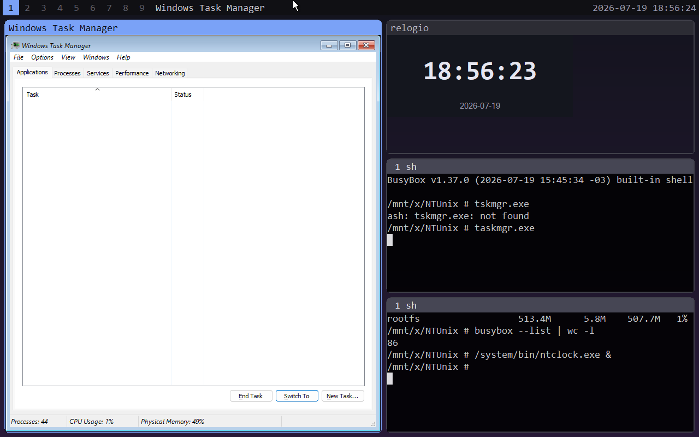
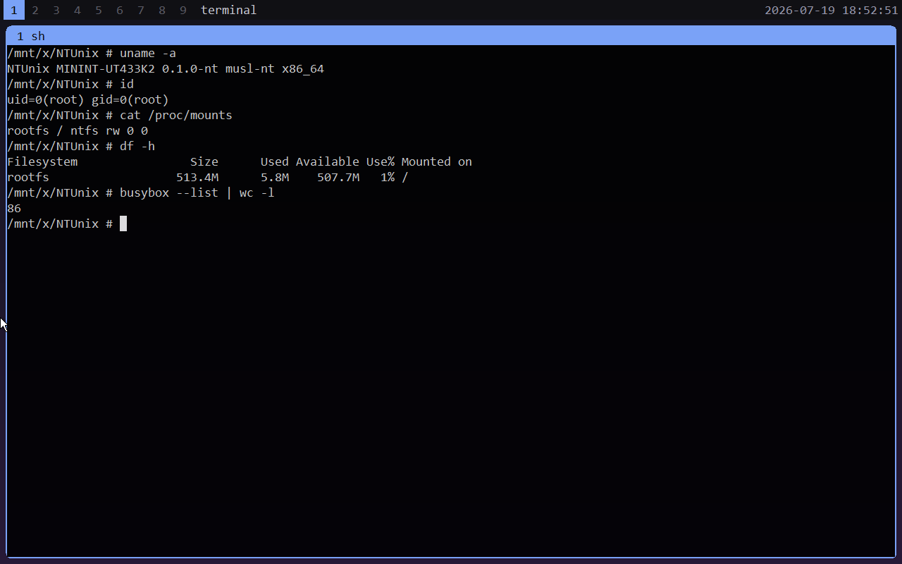
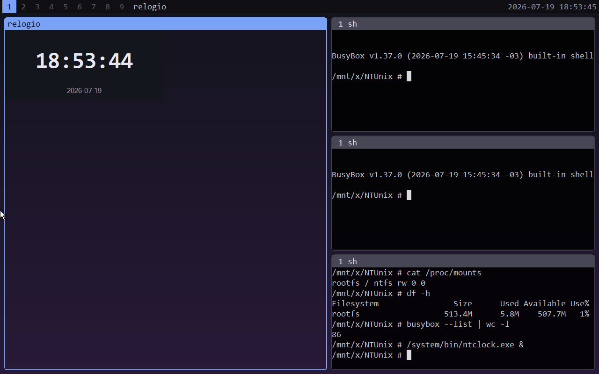

# NTUnix

A Windows distribution with a Unix user space.

NTUnix keeps the Windows NT kernel and its drivers, and replaces everything
above them. The stock Windows user space is removed and a Unix-like one takes
its place: a service supervisor, a libc that talks to NT directly, a display
server, a tiling window manager, and BusyBox coreutils.

The relationship is the same one a Linux distribution has with the Linux
kernel. The kernel and the driver stack are not ours; the system built on top
of them is.

Windows programs keep working. They are discovered, stripped of their frame,
and tiled alongside everything else — here Task Manager sits in the master
column, with the clock and two BusyBox shells in the stack.



Version `0.1.0-dev`. It boots in a VM. It is not a system to depend on.

## What is in it

| | |
|---|---|
| `initd`     | Service supervisor. `.service` units, NT Job Objects with kill-on-close, `Restart=` with throttle, `Requires=` dependencies, `MemoryMax=`, control pipe. |
| `ntctl`     | Control client: `list status start stop restart enable disable logs reload ping shutdown`. |
| `ntsession` | Session shell, in place of `explorer.exe`. Starts initd, hands the screen to dispd, opens a recovery shell if the desktop does not appear. |
| `dispd`     | Display server and compositor. One real root window; each desktop window is a logical surface with its own DIB. Damage tracking, blur, rounded corners, status bar, tabs. |
| `ntwm`      | Tiling window manager, derived from dwm. Master/stack, `mfact`, 9 workspaces, floating. It is a separate process: `ntctl restart ntwm` does not disturb the desktop. |
| `logd`      | Log collector. Appends to `/var/log/system.log` with a timestamp. |
| `musl-nt`   | The libc. musl 1.2.6 lowered to PE/x86-64 with no UCRT and no MSVCRT. Files, directories, stat, statfs, memory, processes, pty, signals, time, ioctl, sockets. `fork()` is absent by design. |
| BusyBox     | 86 applets, built against musl-nt without source patches. |

The libc is the part that makes the rest possible. musl is LP64 and Windows is
LLP64, so each translation unit is compiled as Linux/LP64, run through a
purpose-built LLVM tool that rewrites the calling convention, and lowered to
COFF. The NT backend underneath is about 4,700 lines.

The terminal runs on a native PTY over musl-nt, with libvterm as the VT engine.
ConPTY and console-scrape backends remain as fallbacks.



Applications reach dispd through a shared section object, which is the NT
equivalent of `wl_shm`. `ntclock` is the only application using it so far — the
clock in the screenshots is drawing into a surface the compositor owns.



## Requirements

Built on Linux, cross-compiled with mingw-w64. musl-nt also needs Clang and LLVM,
because it builds an LLVM tool of its own. Image work needs `wimlib`, `xorriso`
and `7z`. Wine runs the test suites.

```sh
pacman -S mingw-w64-gcc clang llvm wimlib xorriso p7zip                       # Arch
apt install gcc-mingw-w64-x86-64 clang llvm wimlib-tools xorriso p7zip-full   # Debian
```

You also supply a Windows ISO. NTUnix redistributes no Microsoft code — the ISO
and the licence are yours, and the build treats them locally.

## Building

musl and BusyBox sources are not kept in the repository. `make deps` fetches
both into `build/deps/` against pinned sha256 sums; it is idempotent and runs
on its own before the targets that need it.

```sh
make                    # user space -> out/
make smoke              # 19 runtime checks under Wine
make check-build        # lint and image dry-run, no ISO needed
make musl-nt            # libc-nt.a + crt0.o
make musl-nt-test       # hello, smoke, allocator, network; rejects UCRT/MSVCRT
make busybox-nt         # busybox.exe against musl-nt
make busybox-nt-test    # coreutils battery under Wine
```

`out/` is a complete NTUnix root and runs under Wine or on Windows without an
image:

```sh
wine out/system/bin/initd.exe &
wine out/system/bin/ntctl.exe list
```

## Building an image

Put a Windows ISO at `build/deps/windows.iso`, or pass `WIN_ISO=`. Both targets
run the full build first.

```sh
make live               # live ISO (WinPE); restarts the libvirt VM
make live NO_BOOT=1     # same, leaving the VM alone
make iso                # installable ISO; applies full Windows, pacstrap-style
./build/test-vm.sh NTUnix.iso    # boot it in a UEFI VM (QEMU/OVMF)
```

The build extracts the source ISO, removes the stock user space listed in
`build/strip.list`, injects the NTUnix tree at `\NTUnix`, sets `ntsession` as
the session shell through `autounattend.xml` and `SetupComplete.cmd`, and
repacks a hybrid BIOS+UEFI ISO.

`OUT_ISO=` names the output, `NTUNIX_EDITIONS="1 6"` limits which editions are
processed, `VM_NAME=` and `VIRSH=` select a different VM. At runtime,
`NTUNIX_ROOT` sets the tree root, `DISPD_BACKEND=gdi|dxgi` picks the present
backend, and `DISPD_TERM=pty|conpty|scrape|demo` forces a terminal backend.

`make debug-live` adds a shared debug terminal reachable over TCP, documented in
`docs/canal-debug-vm.md`. It is unauthenticated and meant for development only.

## Current limits

`ls` returns nothing, with exit code 5, both bare and with a path, while shell
globbing over the same directory works. There is no package manager; `ntpkg` has
not been started, and there is no package format or install path.

The DXGI present backend runs but has not demonstrated its purpose: in a VM
without WDDM it falls back to software and never engages Independent Flip, which
is the reason the backend exists. GDI is the default and the guaranteed path.

Native Win32 windows are tiled in the manner of komorebi — discovered, unframed,
snapped — but the filter is heuristic, and UWP, DPI and minimise are unhandled.
Path translation from `/etc/x` to `<NTUNIX_ROOT>\etc\x` is a seed rather than a
VFS. `logd` handles one client at a time and does not rotate.

## Layout

```
src/common/     ntu.h · ntuwm.h · ntupath (path translation) · ntuini · ntuutil
src/initd/      initd · service · pipesrv        src/ntctl/   control client
src/logd/       log collector                    src/demod/   demo service
src/ntsession/  session shell (replaces explorer.exe)
src/dispd/      compositor · present (gdi/dxgi) · vt · term (pty/conpty/scrape)
                · input · wmproto (dispd<->wm) · appsrv (apps<->dispd) · foreign
src/ntwm/       tiling wm: ntwm · proto · layout
src/apps/       ntclock (demo client of the app surface API)
musl-nt/        nt/ (the NT backend) · tools/ (LP64->COFF rewrite) · test/
third_party/    libvterm (MIT) — the VT engine from vim/neovim
etc/            units/*.service · passwd · group · hosts · mtab · ntwm.conf
build/          fetch-deps · make-iso · make-live · autounattend.xml · strip.list
test/           smoke.sh (runtime) · build-check.sh (image base)
docs/           contracts, audit, research — see docs/README.md
```

Three documents are normative: `docs/VISAO.md` for the architecture,
`docs/PROTOCOLO.md` for the initd control protocol, `docs/musl-nt-spec.md` for
the libc ABI and syscalls. Code that contradicts them is a bug, in one or the
other.

## License

MIT — © Cauã Alvarenga Neves.

Third-party code keeps its own terms: libvterm (MIT) is vendored under
`third_party/`; musl (MIT) and BusyBox (GPL-2.0) are fetched at build time and
never committed. An image produced by `make iso` or `make live` contains
BusyBox, so redistributing that image carries the GPL-2.0 obligations.
